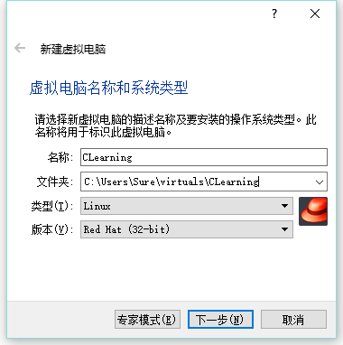
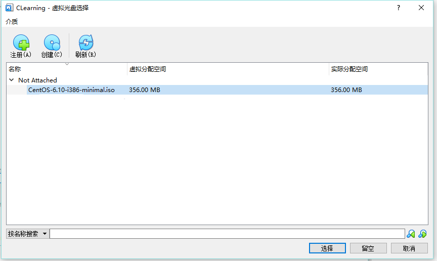
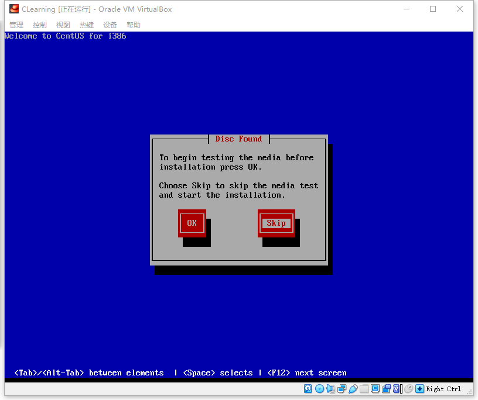
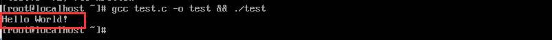
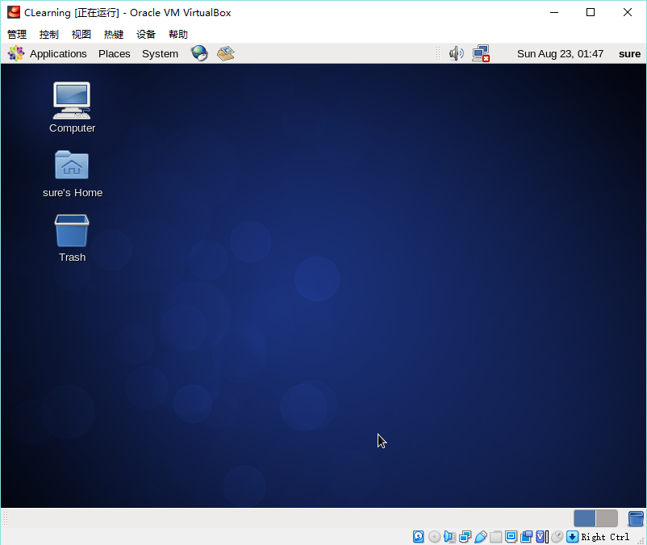
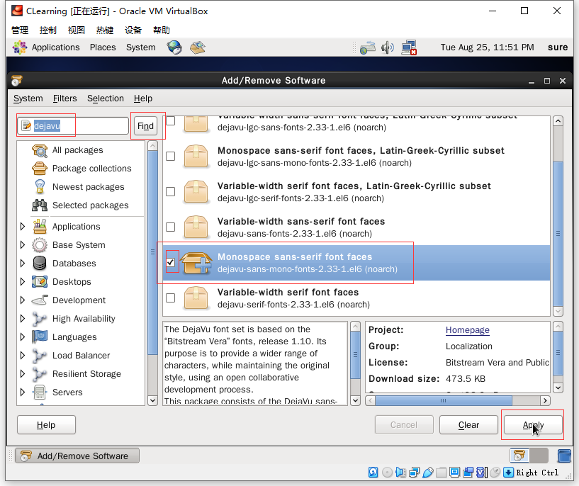

# CentOS 下 C 语言开发环境的构建

[toc]

## VirtualBox 的下载和安装

### VirtualBox 简介

C 语言基础部分的笔记我主要是参照小甲鱼的《带你学 C 带你飞》系列视频来做的。教程的源地址在这里：https://fishc.com.cn/forum-329-1.html

按照小甲鱼的课程安排，基础部分试运行在 32 位的 CentOS 系统中。本来我想用 64 位系统来跟的，但是听小甲鱼介绍说后面用到的一些工具可能不兼容 64 位系统，也就先不节外生枝了吧。毕竟是初学，没必要起幺蛾子。

普通的 Windows 或 Mac 电脑要想运行 CentOS，当然是要安装虚拟机咯。一谈到虚拟机，大家最先想到的应该都是 VMWare。不过 VMWare 有个不好的地方是要收费（没有否定收费的意思哈~），且比较占用系统空间。小甲鱼演示用的虚拟机软件是 VirtualBox，是 Oracle 开发的一款开源免费的虚拟机软件。从前没有接触过，也没有这方面的笔记，这里顺便记录下使用的流程。同时，也是为了和小甲鱼的课程保持一致，避免出现一些不兼容的问题。

闲话少说，开始干吧。

### VirtualBox 下载

官方下载地址：https://www.virtualbox.org/wiki/Downloads

下载页面很直观，按照电脑的操作系统选择就成。比如我的电脑是 Windows 系统，我就直接点击 `Windows hosts`，然后就开始下载了，十分容易。VirtualBox 不需要选择特定的版本，点击以后下载到的就是最新版，用最新版就可以了。


### VirtualBox 安装

下载好以后，双击运行安装包，一开始的界面直接点击 `下一步`：


接下来的页面中，其他的看不懂就直接按默认来，安装位置最好放在系统盘，然后点下一步：


接下来的选择有的就可以按个人喜好了，比如我不喜欢在桌面放图标，就取消了桌面快捷方式的勾选，注册表关联还是加上吧，选好之后点下一步：


因为要设置虚拟网卡，所以可能会断网一小下，他这里给我们提个醒，让我们在不需要网络的时候开始安装，还是挺人性化的。如果此时你不是特别需要网络连接，可以点是继续安装。如果你正在玩游戏，并且在参加关键团战，我建议你打赢比赛以后再继续 `^_^`：


然后点击 `安装`，开始安装：


等着进度条走完：


提示是否安装，当然要安装：


点击 `完成`，即完成安装：


就能看见 VirtualBox 的主界面了：


## CentOS 的下载、安装和配置

### CentOS 简介

CentOS 是一款很著名的 Linux 发行版，开源免费。我们接下来的学习和演示都是在 CentOS 上进行的。

CentOS 官网为：https://www.centos.org/

我们要下载的版本是 32 位的 CentOS 6。前面提到了，不用 32 位系统主要是为了兼容一些 32 位的工具。

为了下载速度更快些，我们可以使用阿里云的镜像：http://mirrors.aliyun.com/centos/6.10/isos/i386/

我们看到，CentOS 有很多不同的版本。DVD 版预装了很多常用的软件，一般的使用情况我们都会下载这个版本。但是为了学习，能够多进行一些操作，多见识一些东西，我们在这里下载几乎没有预装什么多于软件的精简版系统。

这里的 i386 代表 32 位的 CentOS 6，x86_64 代表 64 位。


### VirtualBox 上安装 CentOS

下载好 CentOS，我们就可以把它安装到 VirtualBox 上。

打开 VirtualBox，点击上方的 `新建` 按钮：


设置虚拟机的名称，所在的文件夹，类型为 Linux，版本是 Red Hat 32 位。这里补充一下，CentOS 其实就是免费版的 Red Hat。



内存指定 1 G 即可，不必太大，不要太小：


现在就创建虚拟硬盘：


选择 VDI 类型：


磁盘大小动态分配：


硬盘空间给 5 G 就足够了，存放位置可自由选择：


配置完成后，出现虚拟机管理页面，点击启动，打开虚拟机：


首次启动，会提示我们选择启动盘，可以点击小文件夹选择启动盘：


如果没有提示也没关系，我们可以依次点击 `设备` - `分配光驱` - `选择或创建虚拟盘` 进入选择启动盘的窗口：


新弹出的窗口中点击 `注册`，添加虚拟磁盘：


找到我们刚刚下载到的 32 位 CentOS 6 的镜像：


选中镜像文件，点击 `选择` 即可：



重启虚拟机：


新出来的页面，按回车选择默认的第一项即可：


等黑窗口跳一会儿，然后会出现蓝色的页面，首先要进行一些磁盘测试，没太大必要，直接 skip 即可。这里补充一句，点击虚拟机里面，鼠标会被捕获。如果想要虚拟机释放鼠标，可以按一下**右边**的 CTRL 键：



然后就来到了 CentOS 的安装页面，Next 即可：


这里要选英文，避免出现中文的系统文件夹，后面我们会设置支持中文，然后一路 Next 即可：


这里询问的是要不要删除磁盘中的数据，毕竟是虚拟磁盘，没有有用的数据，直接丢弃即可：


时区选择上海的，也就是北京时间：


设置 root 用户的密码，不要太复杂，忘了会很尴尬，比如我设成了 123456，被警告太简单，生产环境绝不建议使用这么简单的密码，不过自己练习使用是完全没问题的：


这里选择第一个，全盘安装：


再次确认是否清空数据。这没关系，只是虚拟磁盘被清空，真的数据是不会有损失的：


然后就会自动安装了，安装完成以后，重启即可：


进入命令行，输入用户名 root 和刚刚创建的 root 用户的密码（比如我刚刚设置的 123456），即可进入系统：


### CentOS 网络配置

我们前面有提到过，为了能学习更多的东西，所以我们安装的是最精简版的 CentOS 系统。可以说几乎什么功能都没有，连网络都要我们自己来打开。

要打开 CentOS 的网络还是蛮容易的，很符合 Linux 的一贯作风，只需要修改配置文件即可。

CentOS 网络的配置文件为：`/etc/sysconfig/network-scripts/ifcfg-eth0`，最小系统没有 vim，只能用 vi 打开：

```bash
vi /etc/sysconfig/network-scripts/ifcfg-eth0
```

把配置文件中的 ONBOOT 设置成 yes，NM_CONTROLLED 设置成 no，保存退出：


使用命令 reboot 重启系统，生效网络配置。

重启完成后，使用命令测试网络是否调通：

```bash
ping www.baidu.com
```

如果没有显示请求超时，就说明网络已经调通了：


### 安装 gcc 编译器

C 语言代码本身计算机是看不懂的，需要编译成机器码才能执行。gcc 就是一种 C 语言编译器。同样地，因为是最小系统，所以并没有预装在我们的 CentOS 系统中，需要自己手动安装。安装方式也比较简单，使用 yum 安装即可，一条命令便能安装 gcc、c++ 编译器和内核文件：

```bash
yum -y install gcc gcc-c++ kernel-devel
```

使用 yum 安装一切就会很顺畅，一气呵成，直到看到 complete，就安装完成啦！


最后，可以通过一小段 Hello World 代码验证 gcc 编译器是否安装成功。

命令行输入 `vi test.c`，创建一个 C 语言文件。在其中写入如下代码，保存并推出。注意不要遗漏分号和回括号：

```c
#include <stdio.h>

int main()
{
    printf("Hello World!\n");
    return 0;
}
```

输入命令，编译并运行 C 文件：

```bash
gcc test.c -o test && ./test
```

成功打印出了 Hello World：



### 安装 CentOS 图形界面

正如所见，最小版本的 CentOS 是没有图形界面的。熟练的程序员一般也都不需要图形界面来操作 Linux 系统。不过为了能让我们的系统支持中文输入法（主要是为了给程序写注释），我们还是需要一个图形界面的。

CentOS 当前比较流行的图形界面有 GNOME 和 KDE，前者比较轻量高效，后者比较炫酷但更吃资源。

因为我们不需要特别炫酷的东西，这里就用 GNOME 来演示。

首先，安装 X Window System，即 X 窗口系统，是运行在 Linux 下的图形界面程序，GNOME 和 KDE 都是以 X 窗口系统为基础运行的。使用 yum 安装 X 窗口系统：

```bash
yum -y groupinstall "X Window System"
```

安装的东西比较多，需要稍微等一会儿。X 窗口系统安装好后，即可安装 GNOME，也是使用 yum 即可安装：

```bash
yum -y groupinstall "Desktop"
```

- 注：如果要体验 KDE，可使用如下命令安装：

  ```bash
  yum -y groupinstall "KDE Desktop"
  ```

安装完成后，我们需要设置 GNOME 默认启动，编辑配置文件：

```bash
 vi /etc/inittab
```

将最下面的 `id:3:initdefault:` 中的 3 改成 5，3 的含义是命令行启动，5 的含义是开机自动启动图形界面。改好之后，保存退出。


为了安全起见，GNOME 不允许使用 root 用户登录，因此我们还需要创建一个权限较小的用户。

创建用户和设置密码的命令为：

```bash
创建用户：useradd -d 用户主目录 -m 用户名
设置密码：passwd 用户名
```

我设置密码的时候输错了好几次，请无视。。


使用 su 命令，转换到刚刚创建的用户中，比如我刚刚创建的 sure 用户：

```bash
su sure
```

从命令提示符中，我们就可以看出，成功切换到了新用户中，同时代表 root 用户的 # 符号也变成了代表普通用户的 $ 符号。


使用 exit 命令返回到 root 用户，然后重启系统：

```bash
exit
reboot
```

然后基本一直点下一步即可，这里可能会要创建用户，但是没必要，因为我们已经创建好了，直接下一步就行。


然后把使用互联网校验时间勾选上，点完成即可。


然后输入密码，即可进入主页面。



### 安装中文输入法

我们使用图形界面最主要的目的是安装中文输入法。

依次点击左上角的 `Applications -> System Tools -> Terminal` 进入命令行：


此时，命令行的字体还比较难看，过会儿我们会改成看起来舒服些的字体。现在我们还是按部就班，安装中文输入法。


使用命令，切换到 root 用户，按提示输入 root 账号的密码：

```bash
su root
```

注意命令提示符中，用户名的变化。


使用下面两个命令，安装中文输入法，并让 Linux 系统支持中文：

```bash
yum -y groupinstall "Input Methods"
yum -y groupinstall "Chinese support"
```

依次点击左上角的 `System -> Preferences -> Input Method`，打开输入法选择窗口：


勾选 `Enable input method feature` 复选框，选中 `User IBus(recommended)`，然后点击 `Input Method Preferences...` 按钮：


点击 `Input Method` 标签，选择 `Chinese` 下的 `拼Pinyin`：


点击 Add，将拼音输入法添加到输入法列表中，然后点击 Close 关闭标签：


进入终端，使用 `CTRL + 空格` 组合键切换到拼音输入法，我们就可以输入中文了：


### 设置适合编程的字体

我们看到，图形界面的终端中字体重叠严重，左右间距不一，特别难看。所以我们要设置一个适合编程的字体。

对编程而言，比较合适的字体需要满足几个条件：

- 易于识辨，如数字 1、0 和字母 l、O 可以很好的区分，两个单引号 `''` 和双引号 `"` 可以区分；
- 符号（如 # % $ * \）与字母混杂在一起不太丑；
- 必须是等宽字体

这里演示的字体是 dejavu sans mono 字体。

依次点击左上角的 `System -> Administration -> Add/Remove Software` 打开应用商店：


在左侧搜索框输入 `dejavu` ，点击 `Find` 按钮，在结果中找到 `Monospace sans-serif font faces`，点击 `Apply` 按钮，便会自动安装：



弹出框直接点击 `Install` 即可：


最后输入 root 用户的密码，即可授权安装：


安装完成后，打开终端，依次点击 `Edit -> Profile Preferences`：


在 `General` 标签下，取消勾选 `Use the system fixed width font` 前的复选框，字体样式设置为 `Bold` 粗体，然后点击 `OK` 确认保存：


可以在终端中测试字体效果：


通过在终端中，进行如下图几步的操作，可以将命令行风格设置为极客风的黑底绿字：


看起来还是满炫酷的：

