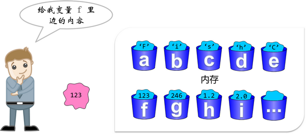

# 变量和常量

[TOC]

## 变量和常量概述

变量和常量是程序处理的两种基本数据对象。

我们把要把 CPU 处理的数据存放在内存中，但如果没有给他安排一个位置，而是随意存放，那么我们在后边需要再次用到这个数据的时候，就再也找不到它了。变量和常量的意义就是确定数据存放在内存中的位置并提供存放的空间。

确定了数据存放的位置，我们还要给这个位置指定一个名称，这样当我们调用这个名称时，就可以很容易地找到它所对应的数据了。

变量和常量都是给某个数据取的别名，只是变量对应的值可能会发生变化，而常量对应的值往往不发生变化。

## C 语言标识符命名规范

变量名、常量名、函数名、数组名、自定义类型等 C 语言中一切名字可以统称为标识符。C 语言中的标识符不能随意命名，需要遵守标识符的命名规范：

1. C 语言标识符只能由英文字母（A\-Z，a\-z）、数字（0\-9）或者下划线（\_）组成，不能包含其他字符。下划线通常用于连接一个比较长的变量名，比如 user_name；
2. 只能以英文字母或下划线开头，而不能以数字开头；
3. 变量名区分大小写。C 语言是大小写敏感的编程语言，也就是大写的 PASSWORD 跟小写的 password 会被认为是不同的两个标识符。在传统的命名习惯中，我们用小写字母来命名变量，用大写字母来表示符号常量名；
4. 不能使用关键字来命名变量。

关键字就是 C 语言内部使用的名字，这些名字都具有特殊的含义。如果你把变量命名为这些名字，那么 C 语言将无法区分变量名和含有特殊含义的关键字，程序便不能正常执行。

传统的 C 语言（ANSI C）有 32 个关键字：  

